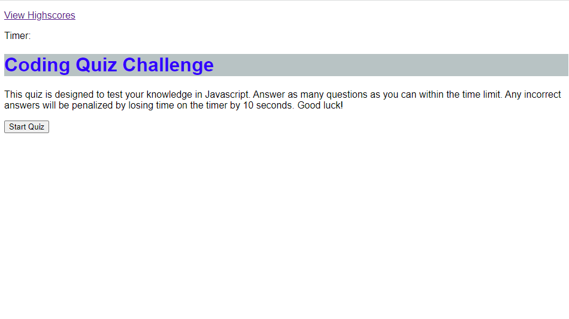

# HW-Challenge-4-JS-Quiz

## Description

Our objective this assignment was to create a website that presents a quiz on Javascript with multiple choice questions and at the end you can save your score.

Main Objectives: 

- when the start quiz button is clicked, the timer begins
- user is presented with the multiple choice questions
- if a question is answered wrong, the user is penalized with lost time
- upon completion of the last question a score is received
- that score can be saved along with initials on a leaderboard

## Links

Application: https://pg1219.github.io/HW-Challenge-4-JS-Quiz/

Repo: https://github.com/pg1219/HW-Challenge-4-JS-Quiz

## Mock-Up

Preview image of deployed application

